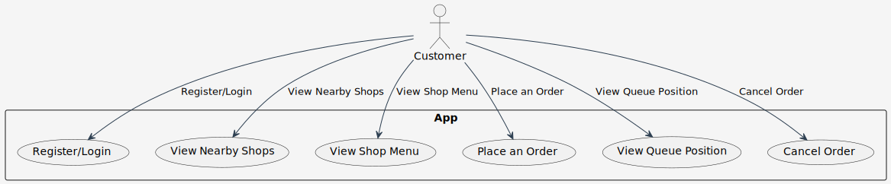
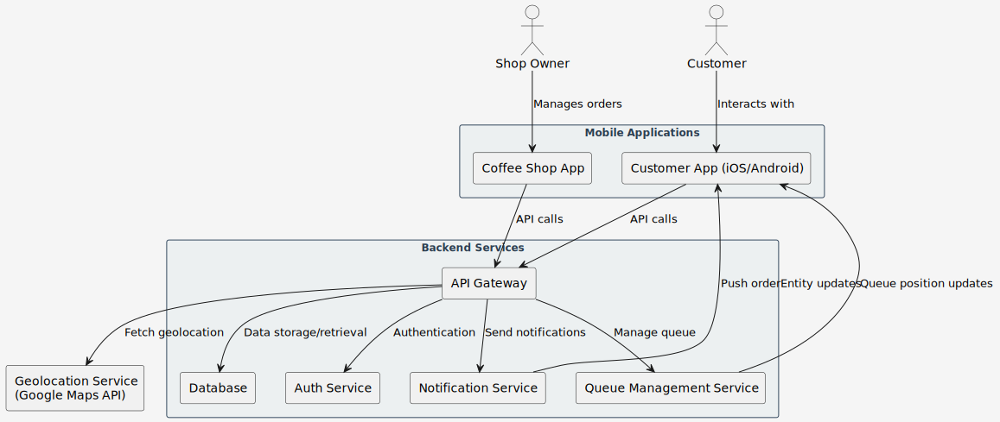
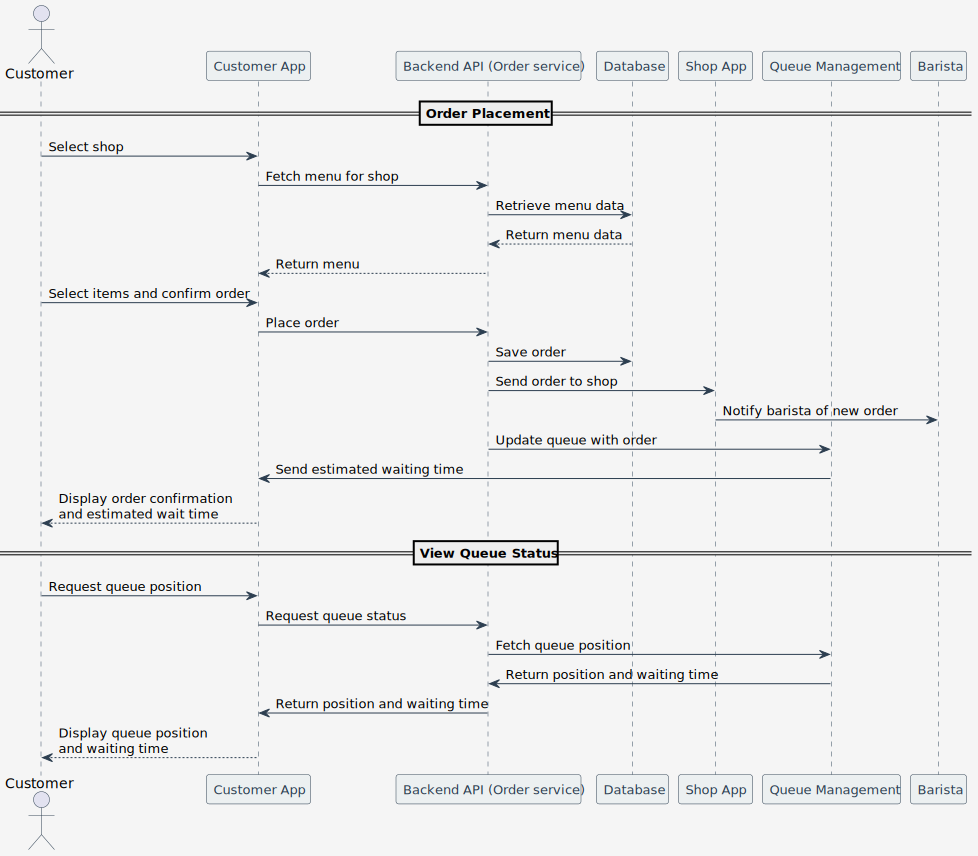
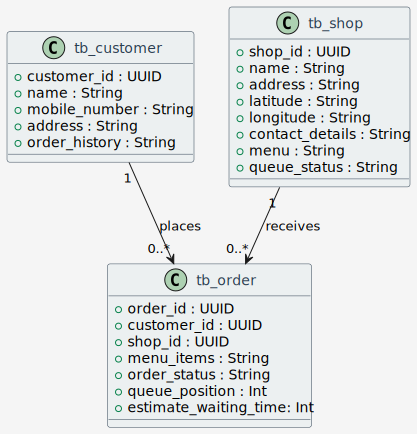
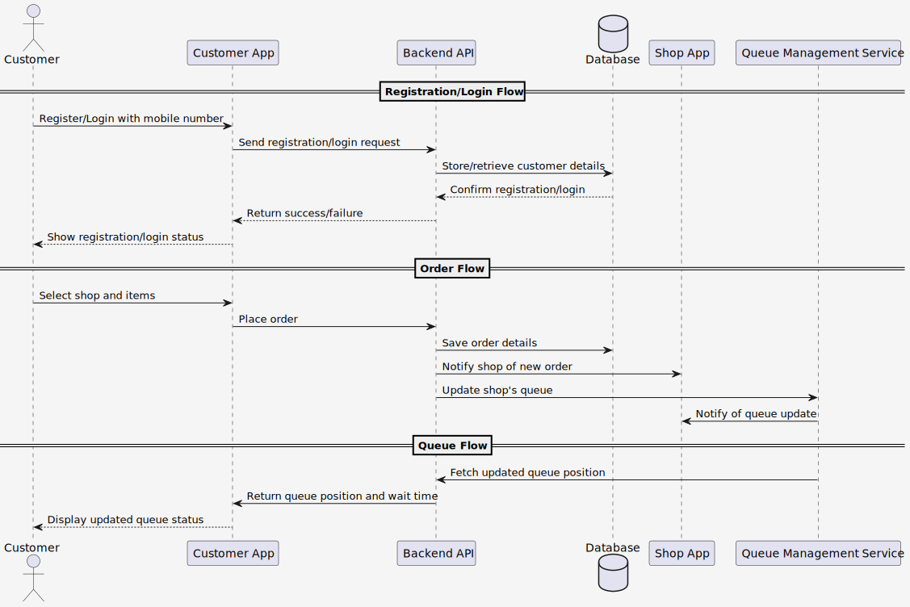

# Customer App

## 1. Solution Design for the Customer App
### Use cases

### Concept

### Sequence

### Data Design

### Data Flows

## 2. Standards to Follow
- **Coding standards**: Follow clean code principles, proper use of OOP and SOLID design patterns.
- **Naming Conventions**: User `camelCase` for variables and methods, `PascalCase` for classes and components, and follow REST API naming conventions (e.g., `/shops/{shopId}/orders`).
- **Security standards**: Follow OWASP top 10 for security. All sensitive information will be encrypted in transit using HTTPS/TLS.
- **Technology Stack**: 
  - Mobile App: React Native (for cross-platform development).
  - Backend: Java Spring Boot.
  - Database: PostgreSQL for data storage.
  - Authentication: OAuth2/JWT for user authentication.
## 3. Security Solution
- **Authentication**: Implement OAuth 2.0 or JWT for secure login and session management (recommend to use Keycloak).
- **Encryption**: All data (both customer and shop) will be encrypted during transit using TLS.
- **Authorization**: Implement role-based access control to ensure shop owners, baristas, and customers have appropriate access rights.
- **Data Privacy**: Comply with GDPR (General Data Protection Regulation) and data protection laws regarding user information.
## 4. API Endpoints
- User Endpoints:
  - `POST api/v1/register`: Register a new customer.
  - `POST api/v1/login`: Login with mobile number and password.
- Shop Endpoints:
  - `GET api/v1/shops`: Get nearby coffee shops using geolocation.
  - `GET api/v1/shops/{shopId}/menu`: Get the menu of a specific shop.
- Order Endpoints:
  - `POST api/v1/orders`: Place an orderEntity at a specific shop.
  - `GET api/v1/orders/{orderId}/status`: Get the current queue position and orderEntity status.
  - `DELETE api/v1/orders/{orderId}`: Cancel the orderEntity.
## 5. Testing Without a Front-End
- **Unit Testing**: Use JUnit for backend services testing.
- **Integration Testing**: Use Postman to test API endpoints. Automated testing with a CI/CD pipeline to run integration tests.
- **Mock Services**: Use services like `WireMock` or `Mockito` to simulate API responses for different test cases.
- **Queue Simulation**: Simulate different queue scenarios using a testing framework, checking how orders are processed and how queue updates work.

# Dev Set Up
[Dev Set Up](DEVSETUP.md)

# Testing
Using postman then import this collection and run one by one
[Postman collection](postman/coffeeChain.postman_collection.json)